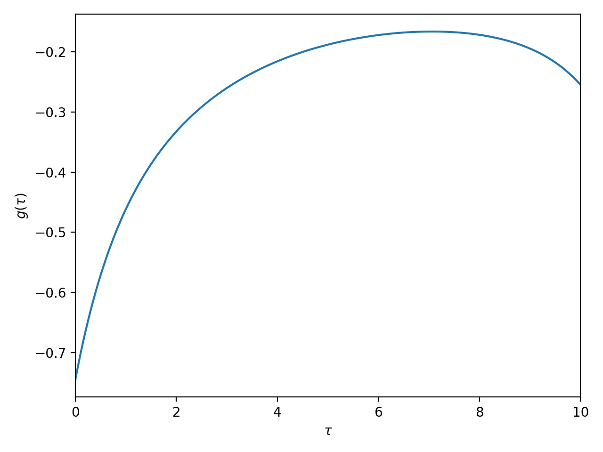

[](
https://krivenko.github.io/QInchworm.jl)
[](
https://github.com/krivenko/QInchworm.jl/actions/workflows/CI.yml)

# QInchworm

A quasi Monte Carlo inchworm impurity solver for multi-orbital fermionic models.

This package implements the quasi Monte Carlo variant of the inchworm algorithm
as described in arXiv:...

Copyright (C) 2021-2023 Igor Krivenko, Hugo U. R. Strand and Joseph Kleinhenz

## Installation

For now, QInchworm can be installed using the explicit repository URL

```
julia> using Pkg
julia> Pkg.add(PackageSpec(url="https://github.com/krivenko/QInchworm.jl", rev="main"))
```

## Usage

The following example demonstrates solution of the single band Anderson model
in thermodynamic equilibrium coupled to a fermionic bath with a semi-elliptic
density of states.

```julia
# For GF containers and DOS objects
using Keldysh; kd = Keldysh
# For exact diagonalization of the atomic problem
using KeldyshED; ked = KeldyshED; op = KeldyshED.Operators

using QInchworm.utility
using QInchworm.expansion: Expansion, InteractionPair, add_corr_operators!
using QInchworm.inchworm: inchworm!, correlator_2p
using QInchworm.ppgf: partition_function, normalize!, density_matrix

using PyPlot

#
# Parameters of the model
#

ϵ = 0.1     # Position of the atomic level
U = 1.0     # Coulomb repulsion constant
D = 2.0     # Half-bandwidth of the bath DOS
V = 0.5     # Coupling strength between the atom and the bath
β = 10.0    # Inverse temperature

# Imaginary time segment τ∈[0; β]
contour = kd.ImaginaryContour(β=β)
# Uniform discrete grid of 200 points on the segment used for inching
grid = kd.ImaginaryTimeGrid(contour, 200)

#
# Exact diagonalization of the atomic problem
#

# Atomic Hamiltonian
H_at = ϵ * (op.n("up") + op.n("dn")) + U * op.n("up") * op.n("dn")
# Set of indices carried by atomic operators
soi = ked.Hilbert.SetOfIndices([["up"], ["dn"]])
# ED object
ed = ked.EDCore(H_at, soi)

#
# Bath
#

# Semi-elliptic bath density of states
bath_dos = kd.bethe_dos(t=D / 2)
# Hybridization function
Δ = V^2 * kd.ImaginaryTimeGF(bath_dos, grid)

#
# Strong coupling expansion
#

# List of pair interactions
int_pairs = [
    InteractionPair(op.c_dag("up"), op.c("up"), Δ),             # c^†_↑(τ) Δ(τ) c_↑(0)
    InteractionPair(op.c("up"), op.c_dag("up"), reverse(Δ)),    # c_↑(τ) Δ(-τ) c^†_↑(0)
    InteractionPair(op.c_dag("dn"), op.c("dn"), Δ),             # c^†_↓(τ) Δ(τ) c_↓(0)
    InteractionPair(op.c("dn"), op.c_dag("dn"), reverse(Δ))     # c_↓(τ) Δ(-τ) c^†_↓(0)
]
# N.B.: These can include types of pair interactions other than hybridization, e.g.
# a density-density coupling n(τ) U(τ) n(0)

# `Expansion` keeps track of atomic propagators and other relevant quantities
expansion = Expansion(ed, grid, int_pairs)

#
# Quasi Monte Carlo inchworm
#

using MPI
MPI.Init()

# Compute the bold atomic propagators using the inchworm algorithm and write results into
# `expansion`
orders_bare = 0:4 # Range of expansion orders to be accounted for during the initial step
orders = 0:4      # Range of expansion orders to be accounted for during a regular step
N_samples = 2^10  # Number of samples for quasi Monte Carlo integration

inchworm!(expansion, grid, orders, orders_bare, N_samples)

# Extract system's partition function from the un-normalized bold propagators `P`
println("Z = ", partition_function(expansion.P))

# Normalize the bold propagators and extract the atomic density matrix
normalize!(expansion.P, β)
println("ρ_{at} = ", density_matrix(expansion.P))

#
# Single-particle Green's function
#

# Register a measurement of the two-point correlator G(τ) = -⟨c_↑(τ) c^†_↑(0)⟩
add_corr_operators!(expansion, (-op.c("up"), op.c_dag("up")))

# Use the bold propagators to perform accumulation of the registered correlator (GF)
orders_gf = 0:2  # Range of expansion orders to be accounted for
g = correlator_2p(expansion, grid, orders_gf, N_samples)[1]

#
# Plot results
#

plt.plot(imagtimes(grid), -g[:matsubara])
plt.xlabel(raw"$\tau$")
plt.ylabel(raw"$g(\tau)$")
plt.xlim((0, β))
plt.tight_layout()
plt.savefig("g_tau.jpg", dpi=200)
```

A possible output of this script is
```
Z = 22.515295574175735 + 0.0im
ρ_{at} = Matrix{ComplexF64}[[0.5147267752890133 + 0.0im;;], [0.2304334197863534 + 0.0im;;], [0.2304334197863534 + 0.0im;;], [0.024406385138280095 + 0.0im;;]]
```


## License

This application is free software: you can redistribute it and/or modify it
under the terms of the GNU General Public License as published by the
Free Software Foundation, either version 3 of the License, or
(at your option) any later version (see http://www.gnu.org/licenses/).

It is distributed in the hope that it will be useful, but WITHOUT ANY WARRANTY;
without even the implied warranty of MERCHANTABILITY or FITNESS FOR
A PARTICULAR PURPOSE. See the GNU General Public License for more details.