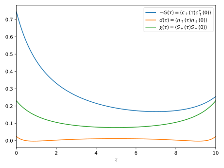

[](
https://krivenko.github.io/QInchworm.jl)
[](
https://github.com/krivenko/QInchworm.jl/actions/workflows/CI.yml)

# QInchworm

A quasi Monte Carlo inchworm impurity solver for multi-orbital fermionic models.

This package implements the quasi Monte Carlo variant of the inchworm algorithm
as described in [arXiv:2310.16957](https://arxiv.org/abs/2310.16957).

Copyright (C) 2021-2023 Igor Krivenko, Hugo U. R. Strand and Joseph Kleinhenz

## Installation

For now, QInchworm can be installed using the explicit repository URL

```
julia> using Pkg
julia> Pkg.add(PackageSpec(url="https://github.com/krivenko/QInchworm.jl", rev="main"))
```

## Usage



The following example demonstrates solution of the single orbital Anderson model
in thermodynamic equilibrium coupled to a fermionic bath with a semi-elliptic
density of states. We compute the single-particle Green's function, the
dynamical double-occupancy and the transversal magnetic susceptibility of the
impurity. The resulting curves are shown above.

```julia
# For GF containers and DOS objects
using Keldysh; kd = Keldysh
# For exact diagonalization of the atomic problem
using KeldyshED; ked = KeldyshED; op = KeldyshED.Operators

using QInchworm.utility: ph_conj
using QInchworm.expansion: Expansion, InteractionPair, add_corr_operators!
using QInchworm.inchworm: inchworm!, correlator_2p
using QInchworm.ppgf: partition_function, normalize!, density_matrix

using PyPlot

#
# Parameters of the model
#

ϵ = 0.1     # Position of the atomic level
U = 1.0     # Coulomb repulsion constant
D = 2.0     # Half-bandwidth of the bath DOS
V = 0.5     # Coupling strength between the atom and the bath
β = 10.0    # Inverse temperature

# Imaginary time segment τ∈[0; β]
contour = kd.ImaginaryContour(β=β)
# Uniform discrete grid of 200 points on the segment used for inching
grid = kd.ImaginaryTimeGrid(contour, 200)

#
# Exact diagonalization of the atomic problem
#

# Atomic Hamiltonian
H_at = ϵ * (op.n("up") + op.n("dn")) + U * op.n("up") * op.n("dn")
# Set of indices carried by atomic operators
soi = ked.Hilbert.SetOfIndices([["up"], ["dn"]])
# ED object
ed = ked.EDCore(H_at, soi)

#
# Bath
#

# Semi-elliptic bath density of states
bath_dos = kd.bethe_dos(t=D / 2)
# Hybridization function
Δ = V^2 * kd.ImaginaryTimeGF(bath_dos, grid)

#
# Strong coupling expansion
#

# List of imaginary-time ordered pair interactions
int_pairs = [
    # c^†_↑(τ_1) Δ(τ_1 - τ_2) c_↑(τ_2), τ_1 ≥ τ_2
    InteractionPair(op.c_dag("up"), op.c("up"), Δ),
    # c_↑(τ_1) [-Δ(τ_2 - τ_1)] c^†_↑(τ_2), τ_1 ≥ τ_2
    InteractionPair(op.c("up"), op.c_dag("up"), ph_conj(Δ)),
    # c^†_↓(τ_1) Δ(τ_1 - τ_2) c_↓(τ_2), τ_1 ≥ τ_2
    InteractionPair(op.c_dag("dn"), op.c("dn"), Δ),
    # c_↓(τ_1) [-Δ(τ_2 - τ_1)] c^†_↓(τ_2), τ_1 ≥ τ_2
    InteractionPair(op.c("dn"), op.c_dag("dn"), ph_conj(Δ))
]
# N.B.: These can include types of pair interactions other than hybridization, e.g.
# a density-density coupling n(τ_1) U(τ_1 - τ_2) n(τ_2)

# `Expansion` keeps track of atomic propagators and other relevant quantities
expansion = Expansion(ed, grid, int_pairs)

#
# Quasi Monte Carlo inchworm
#

using MPI
MPI.Init()

# Compute the bold atomic propagators using the inchworm algorithm and write results into
# `expansion`
orders_bare = 0:4 # Range of expansion orders to be accounted for during the initial step
orders = 0:4      # Range of expansion orders to be accounted for during a regular step
N_samples = 2^10  # Number of samples for quasi Monte Carlo integration

inchworm!(expansion, grid, orders, orders_bare, N_samples)

# Extract system's partition function from the un-normalized bold propagators `P`
println("Z = ", partition_function(expansion.P))

# Normalize the bold propagators and extract the impurity density matrix
normalize!(expansion.P, β)
println("ρ_{imp} = ", density_matrix(expansion.P))

#
# Two-point correlation functions
#

# Register a few measurements of two-point correlators

# Green's function G(τ) = -⟨c_↑(τ) c^†_↑(0)⟩
add_corr_operators!(expansion, (-op.c("up"), op.c_dag("up")))
# Dynamical double-occupancy d(τ) = ⟨n_↑(τ) n_↓(0)⟩
add_corr_operators!(expansion, (op.n("up"), op.n("dn")))
# Transversal magnetic susceptibility χ(τ) = <S_+(τ) S_-(0)>
add_corr_operators!(expansion, (op.c_dag("up") * op.c("dn"),
                                op.c_dag("dn") * op.c("up")))

# Use the bold propagators to perform accumulation of the registered correlators
orders_gf = 0:3  # Range of expansion orders to be accounted for
g, d, χ = correlator_2p(expansion, grid, orders_gf, N_samples)

#
# Plot results
#

plt.plot(imagtimes(grid), g[:matsubara],
         label=raw"$-G(\tau) = \langle c_\uparrow(\tau) c^\dagger_\uparrow(0) \rangle$")
plt.plot(imagtimes(grid), -d[:matsubara],
         label=raw"$d(\tau) = \langle n_\uparrow(\tau) n_\downarrow(0) \rangle$")
plt.plot(imagtimes(grid), -χ[:matsubara],
         label=raw"$\chi(\tau) = \langle S_+(\tau) S_-(0) \rangle$")
plt.xlabel(raw"$\tau$")
plt.xlim((0, β))
plt.legend()
plt.tight_layout()
plt.savefig("output.svg")
```

A possible text output of this script is
```
┌ Info:
│ ________  .___              .__    __      __
│ \_____  \ |   | ____   ____ |  |__/  \    /  \___________  _____
│  /  / \  \|   |/    \_/ ___\|  |  \   \/\/   /  _ \_  __ \/     \
│ /   \_/.  \   |   |  \  \___|   Y  \        (  <_> )  | \/  Y Y  \
│ \_____\ \_/___|___|  /\___  >___|  /\__/\  / \____/|__|  |__|_|  /
│        \__>        \/     \/     \/      \/                    \/
│
│ n_τ = 200
│ orders_bare = 0:4
│ orders = 0:4
│ n_pts_after_max = unrestricted
│ # qMC samples = 1024
│ # MPI ranks = 1
└ # qMC samples (per rank, min:max) = 1024:1024
┌ Info: Diagrams with bare propagators
│ Bare order 0, # topologies = 1
│ Bare order 1, # topologies = 1
│ Bare order 2, # topologies = 3
│ Bare order 3, # topologies = 15
└ Bare order 4, # topologies = 105
[ Info: Initial inchworm step: Evaluating diagrams with bare propagators
┌ Info: Diagrams with bold propagators
│ Bold order 0, n_pts_after 0, # topologies = 1
│ Bold order 1, n_pts_after 1, # topologies = 1
│ Bold order 2, n_pts_after 1, # topologies = 1
│ Bold order 2, n_pts_after 2, # topologies = 2
│ Bold order 2, n_pts_after 3, # topologies = 1
│ Bold order 3, n_pts_after 1, # topologies = 4
│ Bold order 3, n_pts_after 2, # topologies = 6
│ Bold order 3, n_pts_after 3, # topologies = 7
│ Bold order 3, n_pts_after 4, # topologies = 6
│ Bold order 3, n_pts_after 5, # topologies = 4
│ Bold order 4, n_pts_after 1, # topologies = 27
│ Bold order 4, n_pts_after 2, # topologies = 36
│ Bold order 4, n_pts_after 3, # topologies = 40
│ Bold order 4, n_pts_after 4, # topologies = 42
│ Bold order 4, n_pts_after 5, # topologies = 40
│ Bold order 4, n_pts_after 6, # topologies = 36
└ Bold order 4, n_pts_after 7, # topologies = 27
[ Info: Evaluating diagrams with bold propagators
Z = 22.51529557417572 + 0.0im
ρ_{imp} = Matrix{ComplexF64}[[0.5147267752890132 + 0.0im;;], [0.23043341978635334 + 0.0im;;], [0.23043341978635334 + 0.0im;;], [0.02440638513828009 + 0.0im;;]]
┌ Info:
│ ________  .___              .__    __      __
│ \_____  \ |   | ____   ____ |  |__/  \    /  \___________  _____
│  /  / \  \|   |/    \_/ ___\|  |  \   \/\/   /  _ \_  __ \/     \
│ /   \_/.  \   |   |  \  \___|   Y  \        (  <_> )  | \/  Y Y  \
│ \_____\ \_/___|___|  /\___  >___|  /\__/\  / \____/|__|  |__|_|  /
│        \__>        \/     \/     \/      \/                    \/
│
│ n_τ = 200
│ orders = 0:3
│ # qMC samples = 1024
│ # MPI ranks = 1
└ # qMC samples (per rank, min:max) = 1024:1024
┌ Info: Diagrams
│ Order 0, n_pts_after 0, # topologies = 1
│ Order 1, n_pts_after 1, # topologies = 1
│ Order 2, n_pts_after 1, # topologies = 1
│ Order 2, n_pts_after 2, # topologies = 2
│ Order 2, n_pts_after 3, # topologies = 1
│ Order 3, n_pts_after 1, # topologies = 4
│ Order 3, n_pts_after 2, # topologies = 6
│ Order 3, n_pts_after 3, # topologies = 7
│ Order 3, n_pts_after 4, # topologies = 6
└ Order 3, n_pts_after 5, # topologies = 4
[ Info: Evaluating correlator ⟨-1.0*c("up"), 1.0*c†("up")⟩
[ Info: Evaluating correlator ⟨1.0*c†("up")c("up"), 1.0*c†("dn")c("dn")⟩
[ Info: Evaluating correlator ⟨1.0*c†("up")c("dn"), 1.0*c†("dn")c("up")⟩
```

## License

This application is free software: you can redistribute it and/or modify it
under the terms of the GNU General Public License as published by the
Free Software Foundation, either version 3 of the License, or
(at your option) any later version (see http://www.gnu.org/licenses/).

It is distributed in the hope that it will be useful, but WITHOUT ANY WARRANTY;
without even the implied warranty of MERCHANTABILITY or FITNESS FOR
A PARTICULAR PURPOSE. See the GNU General Public License for more details.