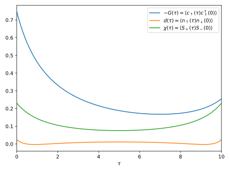

# [Example](@id example)



The following example demonstrates solution of the single orbital Anderson model
in thermodynamic equilibrium coupled to a fermionic bath with a semi-elliptic
density of states. We compute the single-particle Green's function, the
dynamical double-occupancy and the transversal magnetic susceptibility of the
impurity. The resulting curves are shown above.

````@eval
using Markdown
Markdown.parse("""
```julia
$(read("example/example.jl", String))
```
""")
````